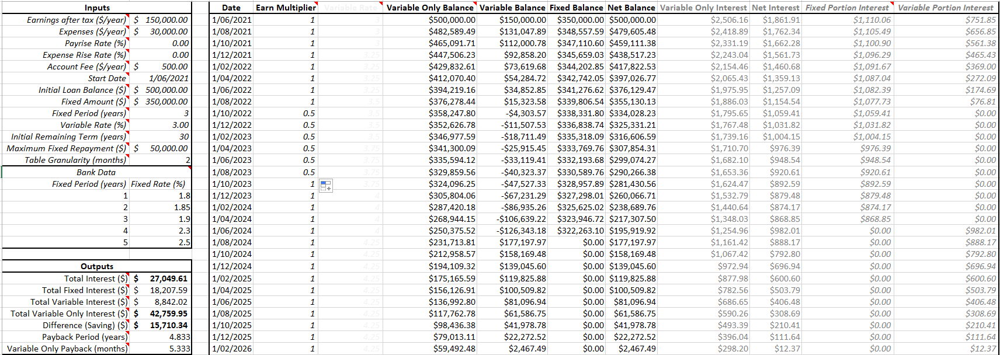

# Split Loan Modelling

A tool to help optimise the term and amount when moving from a variable to a split (variable and fixed) loan. It models the reduction of the loan balances (both fixed and variable portions) over the life of the split loan. Most of the online calculators assume you'll only pay the set repayments to last the full term. This helps model if you want the period to be shorter by paying more (with a fully offset variable portion).



## Suggested Usage

### Setup

Edit the fields in the Input section. The _bank data_ table should be filled in with the current advertised fixed rates from the lender of your choice. The _earn multipliers_ in column F can also be tinkered with. Outputs of interest are generated toward the bottom of columns A and B.

### Optimise
The main values to tweak are the amount to split into the fixed portion and the period of the fixed loan (B9 and B10). The earnings multipliers in column F can be used to model future life events / temporary changes in earnings.

The Solver Add-In is useful to find the optimal period / fixed loan amount for a given scenario. You'll want to maximise the amount saved (B28) whilst modifying cells B9 and B10 (note that B10 needs an integer constraint).

## Notes, Assumptions, and Caveats

This tool should not be relied upon for (and should not be considered as providing) financial advice (see the Licence notice below). Please seek appropriate and qualified expert guidance as required.

### What's modelled

These are only the highlights, there's a few things missing that are also done:
- The table models the reduction in loan balance each quarter. The fixed portion reduces by the fixed repayments (minus interest), whilst the variable assumes all income is put into an offset account. At the end of the fixed period, all the balance is shifted to the variable part.
- The variable only loan is modelled in parallel, allowing the cost of doing nothing to be predicted. The variable rate is the same as for the split loan.
- Changes in the variable rate can be predicted (be sure to set cell B11 to 0, otherwise it is assumed to be constant).
- Earnings per quarter can be reduced by a multiplier, allowing modelling of future life events which may impact earning ability
- Interest for the fixed portion will be reduced by up to the value of the maximum repayment if the variable portion has been completely offset 

### What's not

- The sheet assumes that earnings are always sufficient to cover the variable and fixed repayments. This means that only fixed repayments are modelled.
- The future

## Licence (MIT)
````
Copyright 2021 LS Clark

Permission is hereby granted, free of charge, to any person obtaining a copy of this software and associated documentation files (the "Software"), to deal in the Software without restriction, including without limitation the rights to use, copy, modify, merge, publish, distribute, sublicense, and/or sell copies of the Software, and to permit persons to whom the Software is furnished to do so, subject to the following conditions:

The above copyright notice and this permission notice shall be included in all copies or substantial portions of the Software.

THE SOFTWARE IS PROVIDED "AS IS", WITHOUT WARRANTY OF ANY KIND, EXPRESS OR IMPLIED, INCLUDING BUT NOT LIMITED TO THE WARRANTIES OF MERCHANTABILITY, FITNESS FOR A PARTICULAR PURPOSE AND NONINFRINGEMENT. IN NO EVENT SHALL THE AUTHORS OR COPYRIGHT HOLDERS BE LIABLE FOR ANY CLAIM, DAMAGES OR OTHER LIABILITY, WHETHER IN AN ACTION OF CONTRACT, TORT OR OTHERWISE, ARISING FROM, OUT OF OR IN CONNECTION WITH THE SOFTWARE OR THE USE OR OTHER DEALINGS IN THE SOFTWARE.
````