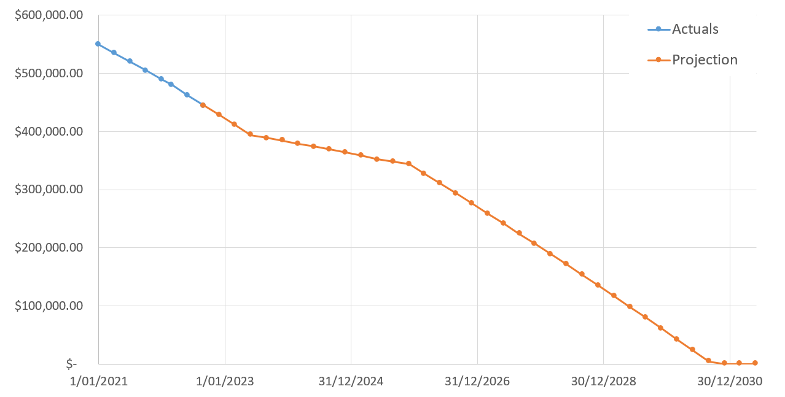

# Home Loan Utilities

Some tools for modelling, tracking, predicting, optimising, or otherwise tinkering with variable and fixed rate home loans.

Most online tools only allow you to forecast with the assumption that you'll pay exactly the specified repayments over the life of the loan. These spreadsheets model what happens if you're a bit more aggressive, including the case where you have access to a fully-offset variable portion.

All the numbers used in both sheets are confected, and are meant to illustrate the usage of the tools.

What's here:
- [Loan Prediction and Tracking Tool](#loan-prediction-and-tracking)
- [Split Loan Optimisation Tool](#split-loan-optimisation)

## A Caveat

These tools should not be relied upon for (and should not be considered as providing) financial advice (see the Licence notice below). Please seek appropriate and qualified expert guidance as required.


## Features

### What's Modelled

Both spreadsheets model the future progression of loan balances given earning and expenditure information. Here is a non-exhaustive list of some interesting things that are modelled:
- They model the reduction in loan balance each quarter. The fixed portion (if present) reduces by the value of the fixed repayments (minus interest), whilst the variable assumes all income is put into an offset account. At the end of the fixed period, all the balance is shifted back to the variable part.
- Changes in the variable rate can be predicted (be sure to set cell B11 to 0, otherwise it is assumed to be constant).
- Earnings per quarter can be reduced by a multiplier, allowing modelling of future life events which may impact earning ability
- Interest for the fixed portion will be reduced by up to the value of the maximum repayment if the variable portion has been completely offset 

### What's Not Modelled

- Both spreadsheets assume you'll always meet your variable and fixed loan repayments, and makes no effort to test if that's not the case.
- Aggressively plowing all your income into a mortgage is non-optimal in a low-interest environment. There's probably better uses for anything sitting in an offset account.
- The future

## Loan Prediction and Tracking

A spreadsheet to both track the progress of a loan, as well as predict the future trajectory of its balance. It evolved from a spreadsheet that was used to choose between multiple lenders' products.



### Features

The spreadsheet can be used to track actual loan balances and charges incurred. From that point, it will make a prediction of the loan balances based on the earnings and expenses inputs. All of these cases are possible:
- Variable only
- Initially completely fixed, becoming variable only afterwards
- Initially split into both fixed and variable portions, becoming variable after
- Splitting at some point during the course of the loan (see ). An example is given in the document.

### Suggested Usage

Fill out your predicted expenses within the `Expenditure Prediction` sheet, and modify the `Tax Rates` sheet as needed. The `Tax Rates` sheet is prepopulated with the Australian Tax Office personal tax rates (current as at June 2021). 

On the main `Tracking` sheet, populate the `Prediction Inputs` section. The sheet is configured to account for a dual income.

Example usages of the tool are provided in separate sheets within the document.

#### Loan Evaluation
If the tool is used to compare various loan options, only cells D2:I2 need to be filled. The tool will predict from that point (whether it's fixed/variable/split will depend on how the main inputs in B2:B11 are configured). 

#### Tracking
Actual recordings of balances and charges can be entered into columns G through J. Overwrite the date in column D with the actual date of the recording.

#### Usage Notes
- The precision of the prediction can be changed by altering the spacing between dates in column D. It is currently set to increment by 3 months per row.
- The earn multiplier in column E can be used to anticipate upcoming changes in earnings.
- Predictions cannot be made for a future split. That is, the prediction won't automatically split the balance in two in a future row. The fixed commencement date (cell B8) is assumed to be on or prior to a row of actual data.
- There _may_ be an error in the transition back to variable only from a split (or fixed only) loan. It will only be off by one row at most. Let me know if you find a bug.


## Split Loan Optimisation 

A tool to help optimise the term and amount when moving from a variable to a split (variable and fixed) loan. It models the reduction of the loan balances (both fixed and variable portions) over the life of the split loan. The variable only loan is modelled in parallel, allowing the cost of doing nothing to be predicted.


### Suggested Usage

#### Setup

Edit the fields in the Input section. The _bank data_ table should be filled in with the current advertised fixed rates from the lender of your choice. The _earn multipliers_ in column F can also be tinkered with. Outputs of interest are generated toward the bottom of columns A and B.


#### Optimise
The main values to tweak are the amount to split into the fixed portion and the period of the fixed loan (B9 and B10). The earnings multipliers in column F can be used to model future life events / temporary changes in earnings.

The Solver Add-In is useful to find the optimal period / fixed loan amount for a given scenario. You'll want to maximise the amount saved (B28) whilst modifying cells B9 and B10 (note that B10 needs an integer constraint).

## Licence (MIT)
````
Copyright 2021 LS Clark

Permission is hereby granted, free of charge, to any person obtaining a copy of this software and associated documentation files (the "Software"), to deal in the Software without restriction, including without limitation the rights to use, copy, modify, merge, publish, distribute, sublicense, and/or sell copies of the Software, and to permit persons to whom the Software is furnished to do so, subject to the following conditions:

The above copyright notice and this permission notice shall be included in all copies or substantial portions of the Software.

THE SOFTWARE IS PROVIDED "AS IS", WITHOUT WARRANTY OF ANY KIND, EXPRESS OR IMPLIED, INCLUDING BUT NOT LIMITED TO THE WARRANTIES OF MERCHANTABILITY, FITNESS FOR A PARTICULAR PURPOSE AND NONINFRINGEMENT. IN NO EVENT SHALL THE AUTHORS OR COPYRIGHT HOLDERS BE LIABLE FOR ANY CLAIM, DAMAGES OR OTHER LIABILITY, WHETHER IN AN ACTION OF CONTRACT, TORT OR OTHERWISE, ARISING FROM, OUT OF OR IN CONNECTION WITH THE SOFTWARE OR THE USE OR OTHER DEALINGS IN THE SOFTWARE.
````